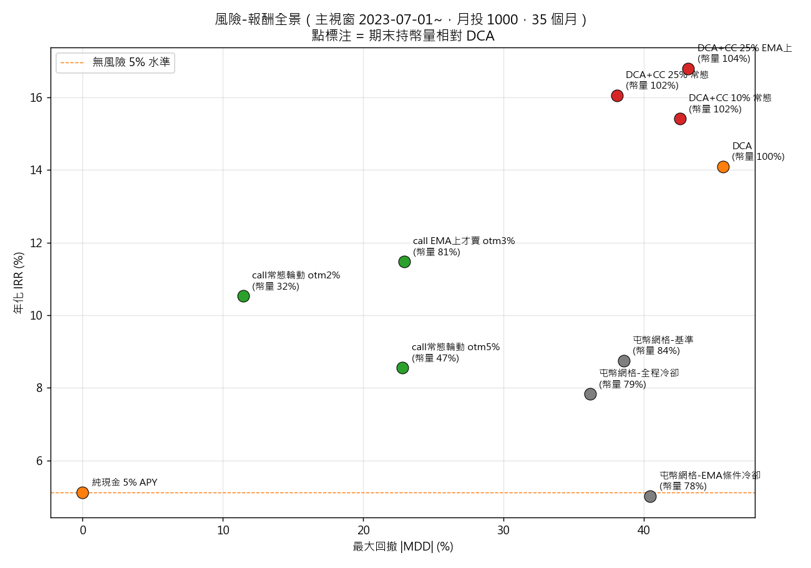

# 網格交易與選擇權增強 DCA 的系統性研究-以BTC為標的
### A Systematic Study of Grid Trading and Options-Enhanced DCA on BTC

> 15 個可重現實驗、3 份研究報告：從「上帝視角」理論上限出發，
> 沿資訊階梯逐級證偽流行策略（含對 arXiv 預印本 DGT 的完整重檢），
> 最終收斂到一個有正期望、可落地的選擇權增強配方——
> 以及一個更重要的結論：**為什麼在無資訊優勢下，幾乎所有「操作」都輸給定投**。

---

## 核心發現（按證據強度排序）

1. **資訊崩塌**：完美區間資訊下網格年化可達 +320%（理論上限），但資訊退化到
   「僅歷史波動率」後優勢歸零——網格參數中**區間位置的資訊價值 ≫ 寬度的資訊價值**，
   而位置（方向）不可預測。
2. **DGT（arXiv:2506.11921）的結論不成立，但數字大致誠實**：等額現金流下
   與 DCA 逐點重合（最密配置淨值比恆為 0.995 = 付 0.5% 磨損複製無腦買入）；
   忠實重現其官方引擎後，IRR 隨參數變化的形狀與論文一致（水準低 6–11pp，
   repo 版本與圖表版本不符）；關鍵差異在**基準選擇**——論文的買入持有基準
   只持有期初本金，而 DGT 的報酬包含了後續全部注資的貢獻；
   換成現金流配對買入持有後，15 組參數全數反轉為落後。
3. **屯幣三假說全部證偽**：「熊市攤平降均價」失敗的最底層原因是
   「等回檔買」在正漂移資產上天生輸給「定時即刻買」（純限價買單階梯實驗）。
4. **收租策略的記帳真相**：covered call 毛權利金的 ~71% 被「履約讓渡」
   這個看不見的機會成本吃掉——權利金永遠看得見、成本永遠看不見，
   這是雙幣理財類產品行銷的結構性盲區。
5. **守恆律**：幣量—法幣報酬—回撤三者不可兼得；所有策略只是選擇三角形上的位置。
6. **唯一找到的正邊際**：波動率風險溢酬（IV>RV）。最終配方
   「DCA + 現金結算式 covered call（25%、EMA上、3% 價外、履約即回購）」
   在 13 個橫跨牛熊的滾動視窗中 **85% 勝過純 DCA**、幣量恆 ≈100%——
   但淨優勢僅 ~1%/年，扣除平台抽成與操作摩擦後，
   **對一般散戶的誠實建議仍是：直接 DCA**。



## 三份報告

| 報告 | 內容 |
|---|---|
| [比較分析報告](reports/比較分析報告.md) | 全策略統一比較、風險-報酬效率前緣、DGT 三層檢驗 |
| [短範圍動態網格屯幣策略結案報告](reports/短範圍動態網格屯幣策略結案報告.md) | 網格屯幣的完整證偽鏈與六條機制診斷 |
| [DCA 選擇權增強策略研究報告](reports/DCA選擇權增強策略研究報告.md) | 從止盈寶/抄底寶構想到 exp15-C 配方的四實驗演進 |

## 實驗索引

| # | 實驗 | 關鍵結論 |
|---|---|---|
| 01–03 | 資訊階梯（上帝視角→歷史→無資訊） | 位置資訊 ≫ 寬度資訊；零期望定理實證 |
| 04 | DGT 等額現金流重現 | DGT ≈ DCA（幣桶占比 100%） |
| 05–08 | 屯幣版網格家族 + EMA 濾鏡 + 冷卻機制 | 單向閥門、逐腿接刀、擇時濾鏡買側全敗 |
| 09–10 | covered call 層（網格桶 / DCA 載體） | 收租最佳載體是 DCA 本身，不是網格 |
| 11 | 純掛買單階梯 | 「等回檔買」的本質劣勢（均價歸因完結） |
| 12 | DGT 官方引擎完整檢驗（1m 資料 + 論文原圖對照） | 報告數值與正確 XIRR 量級相符；換用現金流配對基準後 15/15 反轉 |
| 13–14 | 曝險帶控制器 / EMA 方向雙輪 | 穩態可達成但 P 控制收入歸零；防禦極點 |
| 15 | 消融微調 | 「履約即回購」修復穩健性 → 最終配方 |
| 16 | 定期定額抄底寶 vs DCA | 權利金把「等回檔買」劣勢補到 ±3pp；熊市小贏、牛市小輸、勝率 23% |
| 17 | ETH 移植（零漂移樣本反事實檢驗） | 排名重排證實：DCA 虧損輸給現金、EMA 雙輪三軸奪冠（+7.6%/−37%/幣量 113%）、抄底寶 DCA 勝率 23%→62% |

## 方法論亮點

- **嚴格無前視**：波動率估計只用期初前資料；EMA shift(1)；DVOL 用前日收盤。
- **真實市場定價**：選擇權以 Deribit DVOL（實際隱含波動率指數）+ Black-Scholes 定價，
  附 IV 倍數敏感度。
- **含時間戳現金流的 XIRR**：區分「分批注資視為期初投入」與資金加權報酬的差異（DGT 檢驗核心）。
- **對照組設計**：現金流配對買入持有，把「資金行程表的報酬」與「策略的報酬」分離。
- **逐筆引擎 + 官方程式碼交叉驗證**：DGT 檢驗同時用機制等價重現與其官方引擎雙路徑。
- **審計文化**：所有關鍵主張對存檔結果重算核驗（恆等式檢查、跨實驗主張核對）。

## 重現方式

```bash
pip install -r requirements.txt
python src/fetch_binance.py        # 抓取並快取 K 線（幣安公開 API）
python src/god_view_backtest.py    # exp01：上帝視角基準
python src/realistic_vs_dca.py     # exp03：資訊階梯
python src/dgt_faithful.py         # exp12：DGT 完整檢驗（需先抓 1m 資料，較久）
python src/cc_tuning.py            # exp15：最終配方消融
# 其餘腳本對應各實驗，見各檔案 docstring
```

資料快取（`data/`）與第三方內容（`literature/`）不入庫，首次執行自動下載。

## 限制聲明

僅測試 BTC（2018–2026）；1h 棒內路徑近似（密網格成交數為保守下限）；
現貨手續費 0.1%、選擇權交易費未計；30 天期 DVOL 代理 1 天期 IV；
參數存在輕度樣本內選擇（各 sweep 參數面平滑，主結論不依賴單點）。
**所有 BTC 結論以「正漂移樣本」為前提**——exp17 已在 ETH（主視窗僅 +3.8%）上實證：漂移歸零後 DCA 輸給純現金，防禦/收租型策略排名全面上升。

---

*資料來源：Binance Spot API（K 線）、Deribit（DVOL）。本研究為個人作品集，非投資建議。*
